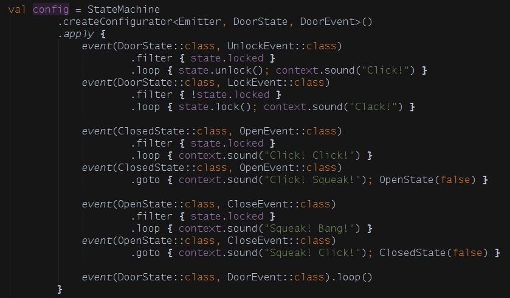

# Stateful for Kotlin
**State Machine Construction Kit for Kotlin**

This is [Stateful](https://github.com/MiloszKrajewski/Stateful) ported to JVM. I could have re-implemented this in Java but there would be no learning factor in it. So I decided to use Kotlin. ...And, oh man, I'm glad I did.

# Requirements
I had some non standard requirements for the state machine:
* **Events should be able to carry data** - for example, hypothetical event `KeyPressed` should also carry information which key has been actually pressed;
* **States should be able hold data** - for example, state collecting key presses (let's call it `EnteringText`) should be able to hold a list of keys pressed so far;
* **Guard statements should have access to both current state and event** - for example, `KeyPressed` event may cause transition to different state depending which key has been pressed;

# Dot Driven Development
One of the design decisions is "Dot Driven Development". The only class which you need to know upfront is `StateMachine`, everything else can be discovered by pressing a dot (and relying on IntelliSense tab completion, whatever you call it).

# Configurator and Executor
Rules of state machine are configured by object called `Configurator` but executed with object called `Executor`. Single `Configurator` can be used to create multiple `Executors`. For example, there is shared set of rules how your communication should work (single `Configurator`) but you can have multiple ports open talking to different servers (many `Executors`).

# Context, State and Event
There are three types you need to provide to `Configurator` - `Context`, `State` and `Event`. While `State` and `Event` are quite obvious, `Context` might need few words of explanation. `Context` is the data shared by all states. As it is not necessary (this shared data could be passed from one state to another) it helps reduce state bloat. Using previous example, you could store remote server address in `Context`. If you think you don't need it (or your religion prevents you from using shared mutable data) just use `Any?` (or `Nothing`) and pass `null` to `Executor`.
* **Context** - type of shared data
* **State** - base class for all states
* **Event** - base class for all events

For conciseness I used `C`, `S` and `E` and template (generic?) parameter names for `Context`, `State` and `Event` respectively.

# Examples
See basic example [here](doc/basic-example.md) and advanced example [here](doc/advanced-example.md).

# Java interoperability
As all Kotlin libs it should just work, but I never tried. Plese do try and let me know.
