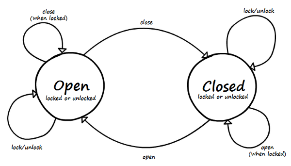

# Advanced example
This is a little bit advanced example than the [other one](basic-example.md). It's still not the best 'door state machine' you've ever seen, though. It is just used to show some usage patterns.

# Definition
There are doors and they can be open or closed, but also locked and unlocked. Please note that there are 4 distinctive states: open/unlocked, closed/unlocked, closed/locked and open/locked (the last one is about door being wide-open but with lock in locked position). To avoid [state explosion](https://en.wikipedia.org/wiki/Combinatorial_explosion) we will model open/closed aspect of it as class, but locked/unlocked as property.



# States
There is a base abstract `DoorState` allowing locking and unlocking:

```kotlin
abstract class DoorState(locked: Boolean) {
    var locked: Boolean = locked; get private set
    fun lock() { locked = true }
    fun unlock() { locked = false }
}
```

and two concrete states, `OpenState` and `ClosedState`:

```kotlin
class ClosedState(locked: Boolean): DoorState(locked) {}
class OpenState(locked: Boolean): DoorState(locked) {}
```

# Events
There is a base (empty) interface for all door events. Note, it could actually be modelled as `abstract class` for a price of some extra typing:

```kotlin
interface DoorEvent
```

There are four events: `OpenEvent`, `CloseEvent`, `LockEvent` and `UnlockEvent`. They all implement `DoorEvent` and carry no data:

```kotlin
class LockEvent : DoorEvent
class UnlockEvent : DoorEvent
class CloseEvent : DoorEvent
class OpenEvent : DoorEvent
```

# Context
We will use same sound `Emitter` as in [basic example](basic-example.md).

```kotlin
interface Emitter {
    fun sound(sound: String)
}

class ConsoleEmitter : Emitter {
    override fun sound(sound: String) = println(sound)
}
```

# Configuration
Let's create a configurator. We will just say that we are going to configure state machine with `Emitter` as `Context`, `DoorState` as `State` and `DoorEvent` as `Event`.

```kotlin
val configurator = StateMachine.createConfigurator<Emitter, DoorState, DoorEvent>()
```

# Rules
Let's define the rules.

* in any state (`state(DoorState::class)`) on unlock event (`event(UnlockEvent::class)`), if door is locked (`filter { state.locked }`) - make the 'Click!' sound (`context.sound("Click!")`), unlock the door (`state.unlock()`) but stay in the same state (`loop { ... }`)
* in any state (`state(DoorState::class)`) on lock event (`event(LockEvent::class)`), if door is unlocked (`filter { !state.locked }`) - make the 'Clack!' sound (`context.sound("Clack!")`), lock the door (`state.lock()`) and stay in the same state (`loop { ... }`)

```kotlin
configurator
    .state(DoorState::class)
    .event(UnlockEvent::class)
    .filter { state.locked }
    .loop { context.sound("Click!"); state.unlock() }
configurator
    .state(DoorState::class)
    .event(LockEvent::class)
    .filter { !state.locked }
    .loop { context.sound("Clack!"); state.lock() }
```

So, locking and unlocking is dealt with. It basically makes the sound, flips `locked` flag but stays in the same state.

Now, for the open and close events.

* in closed state (`state(ClosedState::class)`) on open event (`event(OpenEvent::class)`) if the door is locked (`filter { state.locked }`) - make the 'Click! Click!' sound (`context.sound("Click! Click!")`) but don't change the state (as doors are locked) (`loop { ... }`)
* in closed state (`state(ClosedState::class)`) on open event (`event(OpenEvent::class)`) if all the other rules are not matched (note lack of `filter { ... }`) - make the 'Click!' and 'Squeak!' sound (`context.sound("Click! Squeak!")`), and transition (`goto { ... }`) to opened state (`OpenState(false)`) (or in plain English - open the door)

```kotlin
configurator
    .state(ClosedState::class)
    .event(OpenEvent::class)
    .filter { state.locked }
    .loop { context.sound("Click! Click!") }
configurator
    .state(ClosedState::class)
    .event(OpenEvent::class)
    .goto { context.sound("Click! Squeak!"); OpenState(false) }
```

Stop here for the while. You've just seen 'fallback' handler.

When actual event is fired during execution all possible matching rules are listed. Next step is to filter them using `filter` method (if declared). Please note, that `filter` method may be called quite frequently so it's important to make it fast and with no side effects. Selected rules are then ranked. The rank depend on class distance between declared state/event and actual state/event and the highest rank rule is taken.
In general, there should be only one rule left or decision would be ambiguous, but... the rules without any `filter` defined are considered as 'fallback' rules and ranked lower than filtered rules. Kind of `default` branch in `switch` statement.
Please note, that after this step if there are still multiple or no candidates `UnsupportedOperationException` exception will be thrown.

For completeness, let's declare closing events:

* when door is open and we try to close it but it is locked (you can twist the key in open door, right?) it will not close.

```kotlin
configurator
    .state(OpenState::class)
    .event(CloseEvent::class)
    .filter { state.locked }
    .loop { context.sound("Squeak! Bang!") }
```
* when door is not locked it should work

```kotlin
configurator
    .state(OpenState::class)
    .event(CloseEvent::class)
    .goto { context.sound("Squeak! Click!"); ClosedState(false) }
```

* and for all other cases just do nothing.

```kotlin
configurator.state(DoorState::class).event(DoorEvent::class).loop()
```

That's it. You try to control tis door yourself using unit tests in the project.

# Need more?
There is not more documentation for now, but I recommend reading [unit tests](../src/test/java/org/softpark/stateful4k/StateMachineTest.kt) as they cover large number of features.
