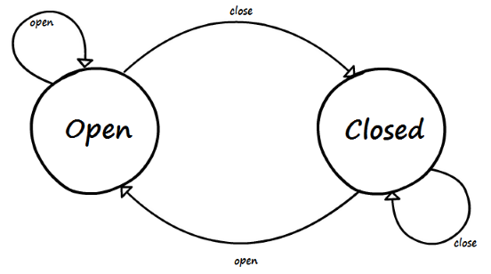

# Basic example
The goal is not to construct best state machine for the Door Problem, it's just about presenting some available mechanisms.

# Diagram


# States
Let's start with possible states. The door can be in two states: the door can be open or closed.

```kotlin
interface DoorState
class OpenState: DoorState
class ClosedState: DoorState
```

# Events
The next thing is define possible events. There are two possible events: door can be opened or closed.

```kotlin
interface DoorEvent
class OpenEvent: DoorEvent
class CloseEvent: DoorEvent
```

# Context
Context is not really needed for this task, but let's assume context in this example will be the object allowing the door to make sounds. Let's call it `Emitter`:

```kotlin
interface Emitter {
    fun sound(text: String)
}
```

Let's implement this interface by printing sounds to console:

```kotlin
class ConsoleEmitter : Emitter {
    override fun sound(text: String) = println(text)
}
```

**NOTE**: as mentioned before, context is not technically needed. It contains data which could be passed from one state to another. It has been introduced for convenience so data shared by all states doesn't have to passed around all the time.

# Configuration
So, let's start configuring our state machine. We need a configurator, and we will use `Emitter` as context, `DoorState` as base class for states and `DoorEvent` as base class for events:

```kotlin
val configurator =
    StateMachine.createConfigurator<Emitter, DoorState, DoorEvent>()
```

# Rules
Note: as code below uses extension functions you need to add specific import statement (and IDE may not help you with that):

```kotlin
import org.softpark.stateful4k.extensions.*
```

Rules are quite simple:

* When doors are closed handle open event

```kotlin
configurator
    .state(ClosedState::class) // in ClosedState
    .event(OpenEvent::class) // on OpenEvent
    .goto { OpenState() } // go to OpenState
```

Code above can be read as "in `ClosedState`, on `OpenEvent` go to `OpenState`". The alternative form (used further) is merging "in" and "on" together but means exactly the same:

```kotlin
configurator
    .event(ClosedState::class, OpenEvent::class) // in ClosedState, on OpenEvent
    .goto { OpenState() } // go to OpenState
```

* When doors are open handle close event

```kotlin
configurator
    .event(OpenState::class, CloseEvent::class)
    .goto { ClosedState() }
```

* Stay in the same state in all other cases

```kotlin
configurator
    .event(DoorState::class, DoorEvent::class)
    .loop()
```

* When doors are opened make the 'Squeak' sound

```kotlin
configurator
    .state(OpenState::class)
    .enter { context.sound("Squeak!") }
```

* When doors are closed make the 'Bang!' sound

```kotlin
configurator
    .state(ClosedState::class)
    .enter { context.sound("Bang!") }
```

# Execution
Once we have state machine configured it's time to run it. We give it `ConsoleEmitter` as context and start in `ClosedState`.

```kotlin
val executor = configurator.createExecutor(ConsoleEmitter(), ClosedState())
```

Once we have executor we can feed events into it:

```kotlin
executor.fire(OpenEvent())
```

and most likely you will see 'Squeak!' printed to console.

**NOTE**: because `enter` handler is triggered for initial state as well, you'll see 'Bang!' preceding 'Squeak!'. I have mixed feeling about that myself. Maybe it should not trigger `enter` on initial state? What is your opinion?

# Advanced example
For more details, you can also try advanced example [here](advanced-example.md).
