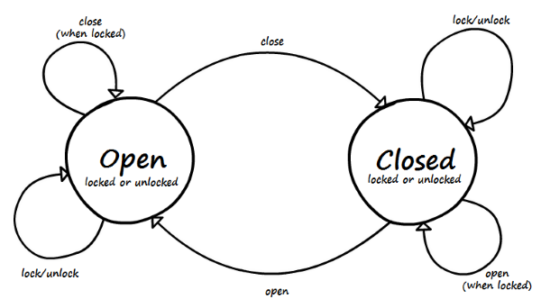

Example
===
The goal is not to construct best state machine for the Door Problem, it's just about presenting some available mechanisms.

Definition
---
There are doors and they can be open or closed, but also locked and unlocked. Please note that there are 4 distinctive states: open/unlocked, closed/unlocked, closed/locked and open/locked (ther last one is about door being wide-open but with lock in locked position).



States
---
There is a base abstract `DoorState` allowing locking and unlocking:

```kotlin
abstract class DoorState(locked: Boolean) {
    var locked: Boolean = locked; get private set
    fun lock() { locked = true }
    fun unlock() { locked = false }
}
```

and two concrete states, `DoorOpened` and `DoorClosed`:

```kotlin
class DoorClosed(locked: Boolean): DoorState(locked) {}
class DoorOpened(locked: Boolean): DoorState(locked) {}
```

Events
---
There is a base (empty) interface for all door events. It could actually be modelled as `abstract class` for a price of some extra typing:

```kotlin
interface DoorEvent
```

There are four events: `OpenEvent`, `CloseEvent`, `LockEvent` and `UnlockEvent`. They all implement `DoorEvent` and carry no data:

```kotlin
class LockEvent : DoorEvent
class UnlockEvent : DoorEvent
class CloseEvent : DoorEvent
class OpenEvent : DoorEvent
```

Context
---
In this case there is no specific context, but for sake of this exercise let's make one up: hypothetical `SoundEmitter` or just `Emitter`.

```kotlin
interface Emitter {
    fun sound(sound: String)
}
```

In this exercise we can implement `ConsoleEmitter` which will just print message to the console:

```kotlin
class ConsoleEmitter : Emitter {
    override fun sound(sound: String) = println(sound)
}
```

Configuration
---
Let's create a configurator. We will just say that we are going to configure state machine with `Emitter` as `Context`, `DoorState` as `State` and `DoorEvent` as `Event`.

```kotlin
val configurator = StateMachine.createConfigurator<Emitter, DoorState, DoorEvent>()
```

Let's define the rules.

* in any state on unlock event (`event`), if door is locked (`filter`) - make the 'Click!' sound, unlock the door but stay in the same state (`loop`)
* in any state on lock event, if door is unlocked - make the 'Clack!' sound, lock the door and stay in the same state

```kotlin
configurator
    .event(DoorState::class, UnlockEvent::class)
    .filter { state.locked }
    .loop { context.sound("Click!"); state.unlock() }
configurator
    .event(DoorState::class, LockEvent::class)
    .filter { !state.locked }
    .loop { context.sound("Clack!"); state.lock() }
```

* in closed state on open event if the door is locked - make the 'Click! Click!' but don't change the state (as doors are locked)
* in closed state on open event if all the other rules are not matched (note lack of `filter`) - make the 'Click!' and 'Squeak!' sound to transition (`goto`) to opened state (or in plain English - open the door)

```kotlin
configurator
    .event(DoorClosed::class, OpenEvent::class)
    .filter { state.locked }
    .loop { context.sound("Click! Click!") }
configurator
    .event(DoorClosed::class, OpenEvent::class)
    .goto { context.sound("Click! Squeak!"); DoorOpened(false) }
```

Stop here for the while. There are two kinds of rules in `Stateful`.
